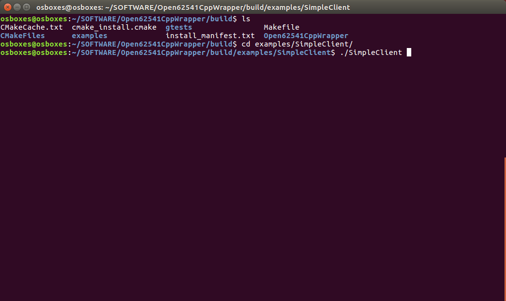

# This is the Open62541CppWrapper Library

This repository provides a lightweight C++ wrapper around the [open62541 C library](https://open62541.org/). The main goal of this C++ wrapper is to implement modern memory management (with proper destructors) for the generic UPC UA types such as **UA_Variant** and **UA_NodeId**. Moreover, this library provides two generic classes **GenericServer** and **GenericClient** that offer a simple and coherent interface for the common **UA_Server** and respectively **UA_Client** methods of the original open62541 C library. These two classes also significantly simplify the implementation of a simple client and a simple server, including the creation of the server-node-space, the initiation of call-back class-member methods when OPC UA variables change their values and simplify the usage of remote OPC UA method calls.

Currently supported features:
* Scope-based auto-cleanup and efficient move-semantics for **UA_Variant** and **UA_NodeId**
* Array support for **UA_Variant**
* Creation of node-space for **UA_Server** and **UA_Client**
* Connection of a **UA_Client** to a remote server
* Asynchronous triggering of a **callback** method implemented as a class member method
* Connection of a class-member method with an **OPC UA remote method** call
 
Not yet implemented features:
* **Automatic discovery** of remote servers based on a simple name (currently an OPC UA address has to be provided at the client to connect to a server)

## Dependencies

The Open62541CppWrapper mainly requires a preinstalled [open62541 C library](https://open62541.org/) in addition to a defaul C++ build infrastructure as listed next:

* [**open62541**](https://open62541.org/): currently tested with version [**1.0**](https://github.com/open62541/open62541/tree/1.0) (follow build instructions below)
* [**CMake**](https://cmake.org/) min. version **3.5**
* A C++ compiler supporting the **C++ 14** standard
* The [C++ **Standard Library** (STD)](https://en.cppreference.com/w/cpp/header)

## Installation instructions for the open62541 base library

Since the Open62541 library version 1.2, the official Debian package of the open62541 C library can be used. The Debian package for the open62541 C library can be installed like this:

```sh
$ sudo add-apt-repository ppa:open62541-team/ppa
$ sudo apt-get update
$ sudo apt-get install libopen62541-1-dev
```

For further, more detailed instructions, please follow the official instructions at [https://open62541.org/](https://open62541.org/).

## Build instructions for the Open62541CppWrapper library

This step assumes that you have built and installed the **open62541** base library as described above. The following instructions have been tested on **Ubuntu 18.04 x64**.

First, you have to clone this repository to your local computer. To do so, open a new terminal an execute this command:

```sh
$ git clone https://github.com/Servicerobotics-Ulm/Open62541CppWrapper.git
```

Now you can simply build the entire library as follows:

```sh
$ cd Open62541CppWrapper
$ mkdir -p build
$ cd build
$ cmake ..
$ make
$ sudo make install
```


## Testing the built-in SimpleServer and SimpleClient examples

The Open62541CppWrapper library comes with two default test-examples, that you can try out and investigate the code. The examples are automatically built as part of the main build process (described in the preceding section). You can execute the two examples as follows.

1. Open a new bash terminal (or use the terminal from the build process above) and go to the location where you have compiled the Open62541CppWrapper.

```sh
$ cd build/examples/SimpleServer
$ ./SimpleServer
```


This server can be accessed by any OPC UA client (we use the [Prosys OPC UA Client](https://www.prosysopc.com/products/opc-ua-client) as an example).


2. Open a new bash terminal and go to the location where you have compiled the Open62541CppWrapper.

```sh
$ cd build/examples/SimpleClient
$ ./SimpleClient
```



### Troubleshooting when getting the runtime "error while loading shared libraries: libopen62541.so.0"

Depending on the current configuration of your Linux installation, you might get the following error when trying to execute the above examples:

```sh
./SimpleServer: error while loading shared libraries: libopen62541.so.0: cannot open shared object file: No such file or directory
```

This is not an error of the library itself but is a problem of your Linux configuration that can be solved in various ways, and two preferred solutions are described next.

First of all, the cause for this problem is that the default system location **/usr/local/lib** is not configured in your system as a default run-time path where libraries are searched. A temporal solution to check whether this is indeed the case is by setting the LD_LIBRARY_PATH as follows:

```sh
$ export LD_LIBRARY_PATH=/usr/local/lib/
$ ./SimpleServer
```

Please note that this does not modify the actual configuration of your Linux installation, but only locally changes the run-time path and you have to repeat this step each time you open a new terminal. A more permanent and the recommended solution is to properly update your Linux' ld configuration as follows (you will need super-user access rights):

```sh
$ sudo su
$ echo "/usr/local/lib/" > /etc/ld.so.conf.d/usr-local.conf
$ ldconfig
$ exit
```

This will add the **/usr/local/lib** as a default run-time path in your Linux system and you don't have to worry about it anymore for your future uses.


