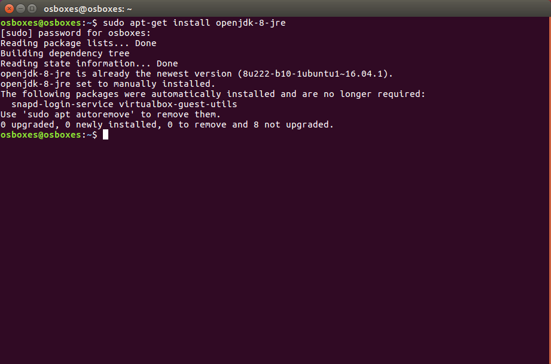
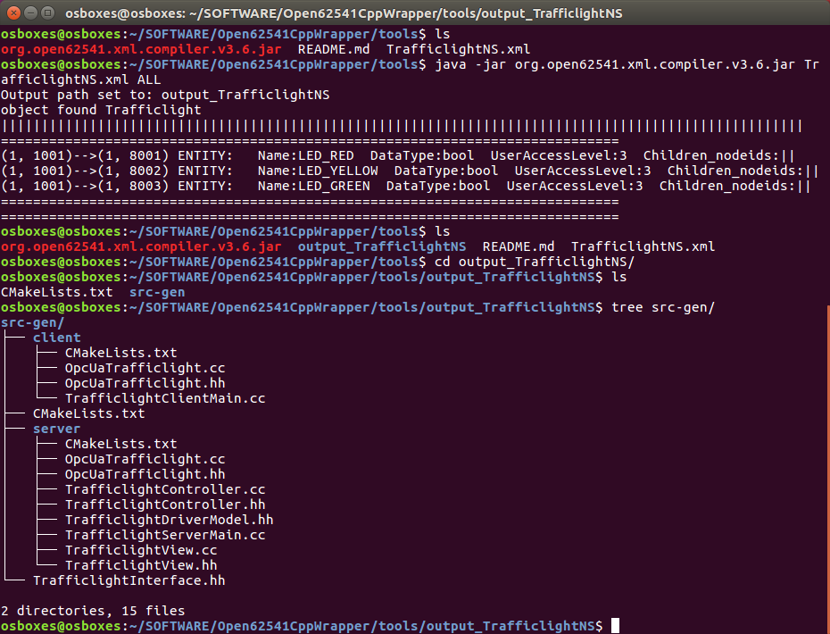
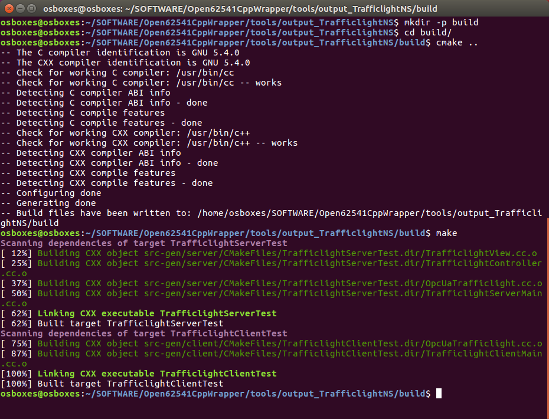
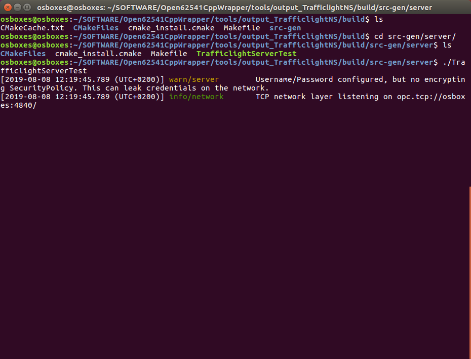
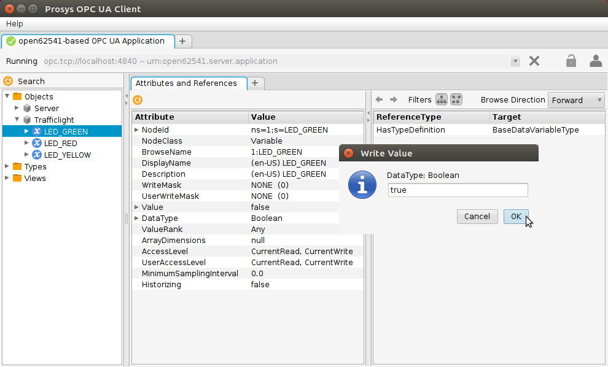

# Tools for Open62541CppWrapper library

This folder consists of tools related to the Open62541CppWrapper library. The first tool is the XML compiler, which takes an OPC UA information model in XML format as input and generates C++ code that uses the Open62541CppWrapper library to create fully fledged OPC UA Clients and Servers. This tool is extracted from the [SmartMDSD Toolchain](https://github.com/Servicerobotics-Ulm/SmartMDSD-Toolchain) (as a stand-alone tool). Its source code can be found here:

* [org.open62541.xml.compiler](https://github.com/Servicerobotics-Ulm/SmartMDSD-Toolchain/tree/master/org.xtend.generators/org.open62541.xml.compiler)

This tool is used as part of the SmartMDSD Toolchain to generate OPC UA C++ code that is embedded in a component. The stand-alone version of this tool can be used to generate a stand-alone C++ code that requires the [Open62541CppWrapper](../Open62541CppWrapper) library as the only dependency.

The tool requires an XML file encoding an OPC UA Information Model following the official node-set schema definition:

* [https://opcfoundation.org/UA/2011/03/UANodeSet.xsd](https://opcfoundation.org/UA/2011/03/UANodeSet.xsd)

The XML compiler tool is also used to generate the basic structure for the stand-alone OPC UA device servers:

* [OpcUaDeviceRepository](https://github.com/Servicerobotics-Ulm/OpcUaDeviceRepository)

The following aspects are interpreted by the XML compiler:

* Base Types: **UAObject**, **UAVariable**, and **UAMethod**
* Primitive Types: Boolean, Double, String, Int32
* Read-only, write-only, and read/write access to variables

Further features might be added on-demand in future versions.

## Dependencies

The XML compiler tool mainly requires Java 8 for execution and the Open62541CppWrapper library for compiling the generated C++ code.

Dependencies for executing the XML compiler tool:

* **Java 8** (e.g. OpenJDK version 1.8 in Ubuntu)

You can install OpenJDK 8 in Ubuntu by opening a new bash terminal and copy-pasting this command:

```sh
$ sudo apt-get install openjdk-8-jre
```


Dependencies for compiling the generated C++ code:

* **Open62541CppWrapper** (see parent folder)
* [**CMake**](https://cmake.org/) min. version **3.5**
* A C++ compiler supporting the **C++ 14** standard
* The [C++ **Standard Library** (STD)](https://en.cppreference.com/w/cpp/header)

## Using the XML compiler

As input, the XML compiler requires an XML file consisting of an OPC UA Information Model. Some fully-fledged XML files that have been used with this tool can be found here:

* [OpcUaDeviceRepository](https://github.com/Servicerobotics-Ulm/OpcUaDeviceRepository)

As example, we will use the [TrafficlightNS.xml](https://github.com/Servicerobotics-Ulm/OpcUaDeviceRepository/blob/master/OPCUATrafficlight/TrafficlightNS.xml) (from the above repository) to explain the usage of the XML tool.

The tool can be executed e.g. in Ubuntu by opening a terminal and copy-pasting the following command:

```sh
$ java -jar org.open62541.xml.compiler.v3.6.jar TrafficlightNS.xml ALL
```

Please note the two additional parameters following the jar file in the command. The first parameter TrafficlightNS.xml is the XML file and should be replaced by your actual model. The last parameter specifies what has to be generated. Here are the supported options:

* **ALL**: generates an OPC UA Client, Server and a Model-View-Controller structure for the server
* **CLIENT**: generates C++ code for a stand-alone OPC UA Client
* **SERVER**: generates C++ code for a stand-alone OPC UA Server
* **MVC**: generates a Model-View-Controller C++ code and a stand-alone OPC UA Server

The last option is useful for decoupling the OPC UA Server code from a device-driver code, which has been used for implementing the devices in the [OpcUaDeviceRepository](https://github.com/Servicerobotics-Ulm/OpcUaDeviceRepository).

The XML compiler creates a new local folder named "output_TrafficlightNS". The output folder will further have a CMakeLists.txt file that can be used to build the generated code (see below) and another subfolder named "src-gen". Depending on your selected compiler option, the src-gen subfolder will have the generated C++ code artifacts.



For building the C++ code, we assume that you have built and installed the Open62541CppWrapper library (see parent [README](../README.md) file). To build the generated C++ code, open a new terminal and type in the following commands:

```sh
$ cd output_TrafficlightNS
$ mkdir -p build
$ cd build
$ cmake ..
$ make
```


The generated C++ code fully initializes the OPC UA client/server part which can even be executed already. However, the OPC UA client/server is not yet doing anything useful as the related business logic is missing, and has to be added. Yet, the built server (and client respectively) can be executed as follows:

```sh
$ cd src-gen/server
$ ./TrafficlightServerTest
```


Please note, that the name of the executable is constructed from the Root-Object name specified in the XML file and the postfix "ServerTest". In our example, this amounts to "TrafficlightServerTest".

This server can be accessed by any OPC UA client (we use the [Prosys OPC UA Client](https://www.prosysopc.com/products/opc-ua-client) as an example). 


The business logic can be added by implementing the two pre-generated C++ classes with the suffix "DriverModel" and "Controller". In our examples, the two classes are "TrafficlightDriverModel" and "TrafficlightController". The DriverModel is completely indepndent of any OPC UA code and is supposed to implement the platform-specific driver code. The Controller is the glue class that manages the interaction between the OPC UA server and the DriverModel.
